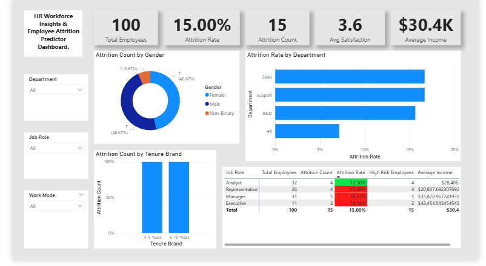

# 📊 HR Workforce Insights & Employee Attrition Predictor

## 📌 Project Objective
Replacing an employee can cost a company up to 200% of their annual salary. This project transitions HR from operational reporting to diagnostic analytics. The dashboard is designed to empower HR teams and business leadership to make data-driven decisions regarding retention, compensation, and work-life balance.

## 🛠️ Tools & Technologies Used
- **Power BI:** Data visualization, interactive dashboard design.
- **Power Query:** Data extraction, transformation, cleaning, and custom banding (Age & Tenure).
- **DAX (Data Analysis Expressions):** Complex measure creation for deep-dive analytics.

## 🔍 Key DAX Measures Formulated
- `Total Employees = COUNTROWS('HR_Employee_Data')`
- `Attrition Rate = DIVIDE([Attrition Count], [Total Employees], 0)`
- `High Risk Employees = CALCULATE([Total Employees], 'HR_Employee_Data'[Attrition Risk Level] = "High")`

## 📈 Dashboard Preview

## 💡 Key Business Insights Derived
1. **The Overtime Burnout:** A significant portion of departing employees were consistently working overtime, indicating a need to reassess workload distribution.
2. **Tenure Flight Risk:** The highest concentration of attrition occurs within the 0-2 year tenure band, suggesting flaws in the onboarding process or initial role alignment.
3. **Departmental Focus:** The Sales department exhibits the highest turnover rate, directly correlating with lower average work-life balance scores.

## 📂 Repository Contents
- Raw Dataset (xlsx)
- Power BI File (.pbix)
- High-Resolution Dashboard Screenshots (png)
- High-Resolution Dashboard Screenshots (pdf)
